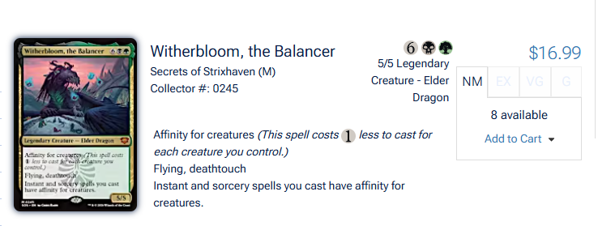

# 📊 Progreso: Geekorium Omni-TCG (v2.0)

**Última Actualización**: 2026-04-27 02:15
**Estado**: 🏗️ Fase 1: Estructura y Requerimientos

---

## Roadmap de Ejecución

### 🏗️ Fase 1: Estructura (Compounding)
- [x] Definición de Historias de Usuario (`OMNI_TCG_REQS.md`)
- [x] Configuración de Task List (`task.md`)
- [x] Establecimiento de PROGRESS_OMNI.md
- [ ] Aprobación de estructura por el usuario

### ⚙️ Fase 2: Motor de Datos (Backend & DB)
- [ ] Índices GIN y Optimización de Esquema
- [ ] Refactorización de Lógica SKU-Aware
- [ ] Loader: Pokémon TCG (API v2)
- [ ] Loader: Digimon TCG (Resilient Scraper)
- [ ] Loader: TCGPlayer Bridge (One Piece / Gundam)

### 🚀 Fase 3: Orquestación & UI
- [ ] GitHub Actions Pipelines (Metadata & Prices)
- [ ] Soporte de Filtrado Profundo (Edge Functions / RPC)
- [ ] Validación de Integridad de Assets (WebP / Supabase Storage)

---

## Log de Decisiones
- **2026-04-27**: Se decide crear documentación separada (`OMNI_TCG_*.md`) para evitar ruido en la documentación principal de MTG hasta la validación final.
- **2026-04-27**: El algoritmo SKU-Aware se estandariza como `[F]SET-NNNN` para todos los nuevos TCGs.
