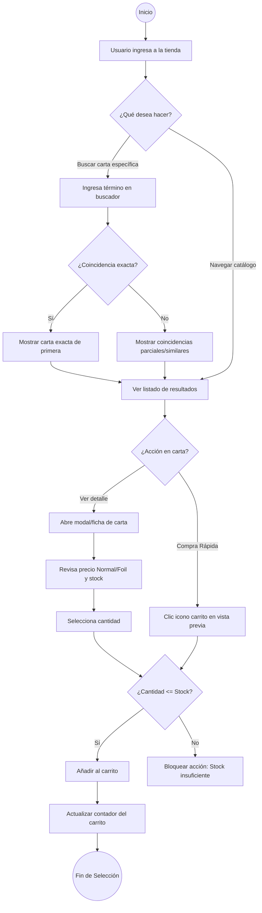
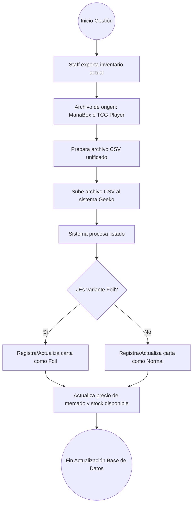

# Flujos de Procesos y Análisis (BPMN / Diagramas de Flujo)

A partir de los documentos de PRD analizados (`Geeko FIX 3(1).md` y `Geeko diseño fix.md`), he identificado tres (3) flujos principales del sistema. A continuación se presentan los diagramas (usando sintaxis Mermaid) y un análisis de los puntos ciegos o elementos que faltan por definir.

---

## 1. Flujo de Búsqueda y Selección de Productos

Este flujo abarca desde que el usuario busca una carta hasta que la añade al carrito de compras.



---

## 2. Flujo de Compra (Checkout)

Abarca el momento en el que el usuario decide finalizar su pedido.

```mermaid
graph TD
    Start((Inicio Checkout)) --> B[Usuario revisa carrito]
    B --> C[Selecciona "Proceder al Checkout"]
    C --> D[Formulario de Datos del Cliente]
    D --> E[Ingresa Nombre, Cédula, Teléfono]
    E --> F[Ingresa Email]
    
    F --> G{¿Email con formato válido?}
    G -->|No| H[Mostrar error de validación]
    H --> F
    
    G -->|Sí| I[Selecciona Ubicación: Estado/País]
    I --> J{Selecciona Método de Despacho}
    J -->|Pick up| K[Aplica lógica de retiro]
    J -->|Delivery| L[Aplica costo de delivery]
    J -->|Envío Nacional| M[Aplica costo de envío]
    
    K --> N[Confirmar Pedido]
    L --> N
    M --> N
    
    N --> O((Orden Generada))
    
    %% Acciones post-orden
    O --> P[Sistema envía email de confirmación al cliente]
    O --> Q[Sistema envía alerta de orden al staff]
    O --> R[Pausa: Esperar a que el staff coordine pago vía WhatsApp/Correo]
```

---

## 3. Flujo de Gestión de Inventario (Staff)

Proceso interno para cargar la disponibilidad física desde archivos exportados.



---

## 🔍 Análisis: ¿Qué falta o qué no está definido en el PRD?

Al revisar los flujos vs. los requerimientos, detecto los siguientes "puntos ciegos" que deberíamos considerar:

1. **Autenticación (Login/Registro):**
   * ¿El sistema permite cuentas de usuario para guardar el historial de pedidos y direcciones, o el Checkout es 100% "Guest" (Invitado)? El PRD solo menciona el Checkout, pero no habla de inicio de sesión.

2. **El Flujo del Comprobante de Pago:**
   * En el PRD se menciona la reparación del botón *"Cargar comprobante"*, pero en el flujo de Checkout dice: *"El cliente no paga hasta que el staff verifique la existencia física y coordine vía WhatsApp"*.
   * **Problema:** Si el usuario cierra el navegador después de hacer el pedido, ¿cómo accede luego a "Cargar el comprobante"? ¿El correo de confirmación incluye un link único para subir el comprobante una vez que el staff da luz verde por WhatsApp?

3. **Manejo de estados de la Orden (Admin):**
   * Falta definir los estados por los que pasa un pedido una vez generado. Ejemplo: `Pendiente de Pago` ➔ `Verificando Comprobante` ➔ `Pagado / Preparando` ➔ `Enviado / Listo para Pick up`.

4. **Reglas de sincronización del Stock POST-Compra:**
   * ¿El stock se descuenta temporalmente apenas el usuario genera la orden (reserva), o solo se descuenta cuando el administrador "Aprueba" el pago? Si no se descuenta al generar la orden, dos usuarios podrían comprar la misma carta si el proceso es muy lento.
