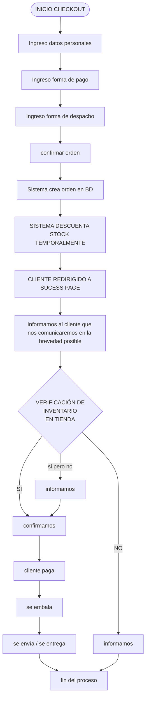

# 🛒 Documentación del Flujo de Checkout (Corregido)

Este documento describe paso a paso el proceso actualizado de compra (checkout) de la tienda, desde que el usuario inicia el pago hasta la entrega del producto.

## 📊 Diagrama del Flujo

## 📝 Descripción Detallada por Fases

### Fase 1: Recopilación de Datos del Cliente

1. **Inicio de Checkout**: El usuario revisa su carrito y decide proceder con la compra.
2. **Ingreso de datos personales**: Se le solicita al cliente proporcionar su información básica de contacto (ej. nombre, RUT, o correo electrónico).
3. **Ingreso de forma de pago**: El cliente selecciona el método con el que desea saldar el monto total (transferencia, pago en tienda, etc.).
4. **Ingreso de forma de despacho**: El usuario indica cómo desea recibir su pedido (retiro presencial en tienda o envío a domicilio) y completa los datos de entrega correspondientes.
5. **Confirmar orden**: El cliente da un último vistazo a todo lo ingresado y emite de manera oficial la orden.

### Fase 2: Procesamiento Inicial (Sistema Central)

6. **Sistema crea orden en BD**: La plataforma recibe la orden y la inscribe en la base de datos de manera automatizada.
2. **SISTEMA DESCUENTA STOCK TEMPORALMENTE**: Paso crítico para evitar dobles ventas. Los productos contenidos en la orden se separan virtualmente para este cliente y dejan de estar disponibles para el resto del público.
3. **Cliente redirigido a Success Page**: La pantalla cambia confirmando el registro exitoso de la orden de compra.
4. **Aviso de contacto pendiente**: En esta misma pantalla (o mediante un correo electrónico), se le notifica al cliente que un vendedor de la tienda se comunicará a la brevedad para rectificar el pedido antes del pago.

### Fase 3: Operaciones Físicas (Trastienda / Backoffice)

10. **Verificación de inventario en tienda**: El equipo recoge la orden del sistema y se dirige a las repisas o vitrinas para corroborar en físico el estado y disponibilidad real de los ítems. Este punto de control bifurca el flujo en tres posibles escenarios:
    * **✅ SÍ (Confirmación directa)**: Todo está en orden. Se procede a notificar de inmediato al cliente.
    * **⚠️ SÍ, PERO NO (Confirmación parcial/con objeciones)**: Faltan algunosp productos, la edición difiere de la publicada o hay un defecto estético previamente no contemplado. Se le **informa** la situación al cliente. Si este ratifica el cambio, la orden se **confirma** (se reencausa y sigue el procedimiento habitual).
    * **❌ NO (Sin stock físico)**: Hubo un quiebre de stock real (ej. se vendió por otro canal justo antes y no se había actualizado el sistema). Se contacta al cliente, se le **informa** que es imposible cumplir la orden y el proceso termina directamente, restituyendo el stock virtual.

### Fase 4: Liquidación y Despacho

11. **Cliente paga**: Una vez confirmada a ciencia cierta la existencia del producto por el staff de tienda, el usuario transfiere o deposita el dinero. *(Note: si seleccionó pago en tienda, este paso se funde con la recogida)*.
2. **Se embala**: El paquete es preparado, empaquetado de forma segura y etiquetado para su expedición.
3. **Se envía / se entrega**: Si el cliente solicitó despacho, el paquete se entrega al couriers; si solicitó retiro en tienda, se le hace la entrega presencial de sus productos en mano.
4. **Fin del proceso**: Conclusión del pedido; la orden pasa a estado Completado.
